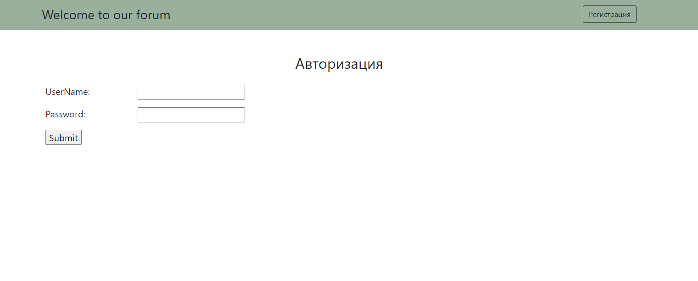
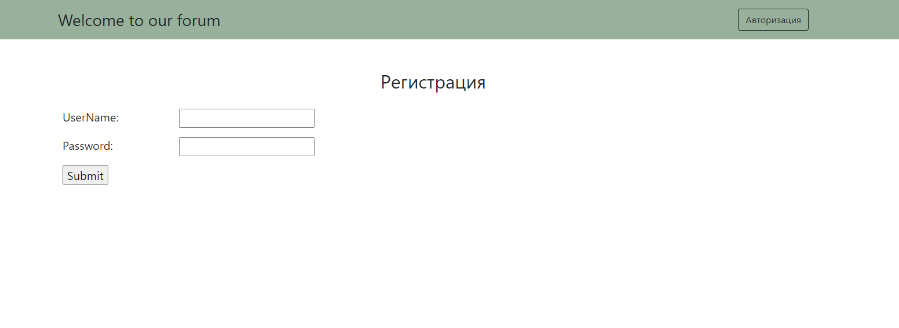
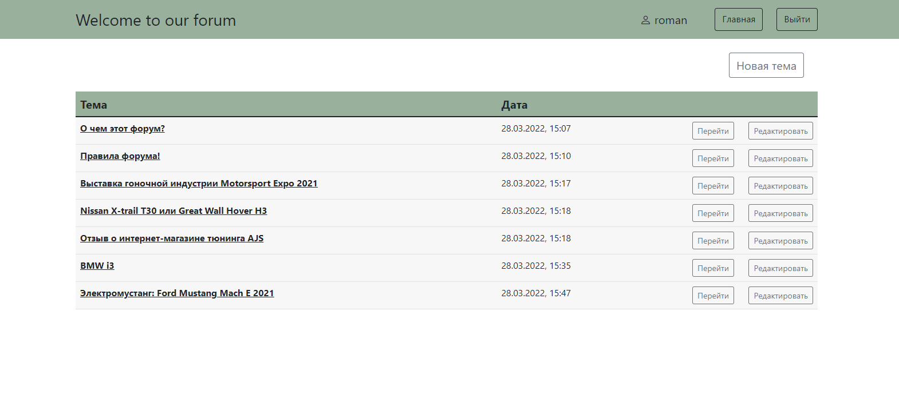
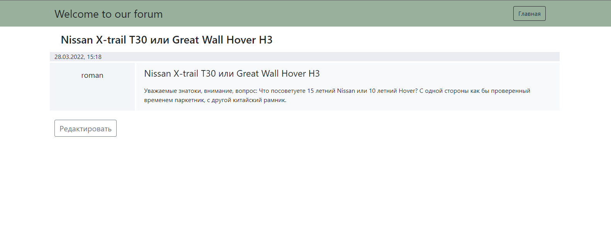
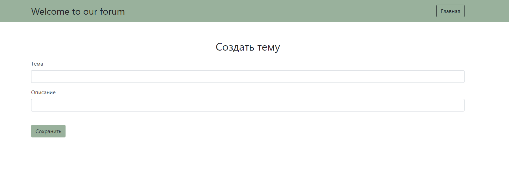
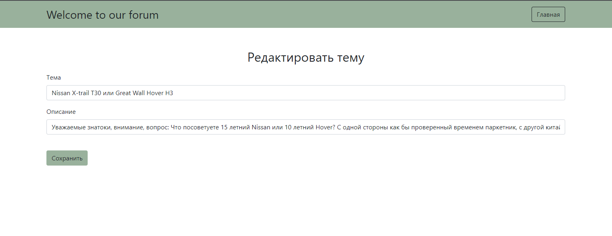

# Forum (Spring Boot App)

#### Description:
Repository contains implementation simple model of forum which demonstrate working with Spring Boot. 
                         
#### Technologies:
- Java 11
- Spring Boot(Data, Security, Test)
- PostgreSQL
- Maven
- Liquibase
- JSP, HTML, Bootstrap 5
#### Visual application interface
+ __User authentication__

<kbd>

+ __Registration in the system__

<kbd>

+ __All posts list__

<kbd>

+ __Post__

<kbd>

+ __Add a new post__

<kbd>

+ __Editing a post__

<kbd>